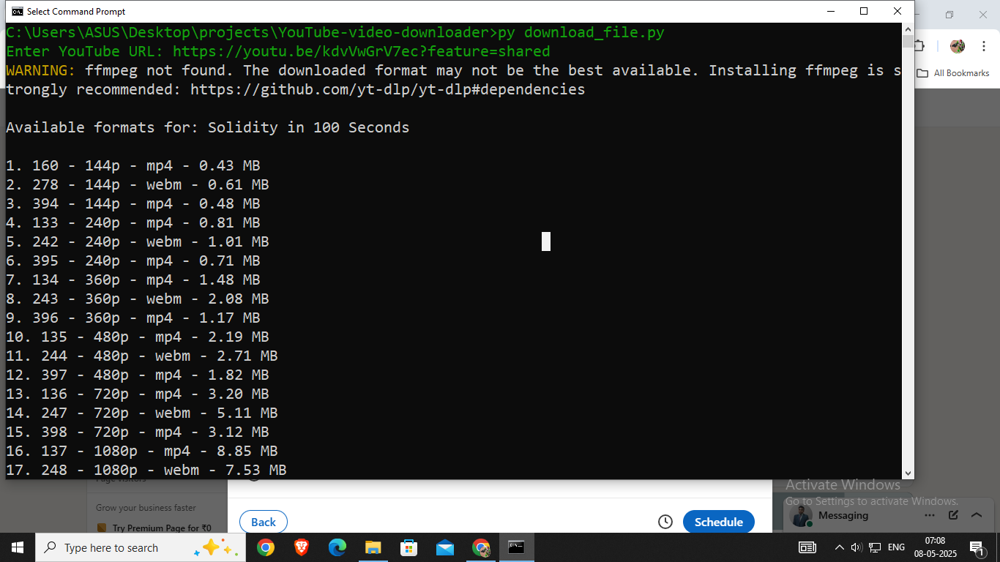
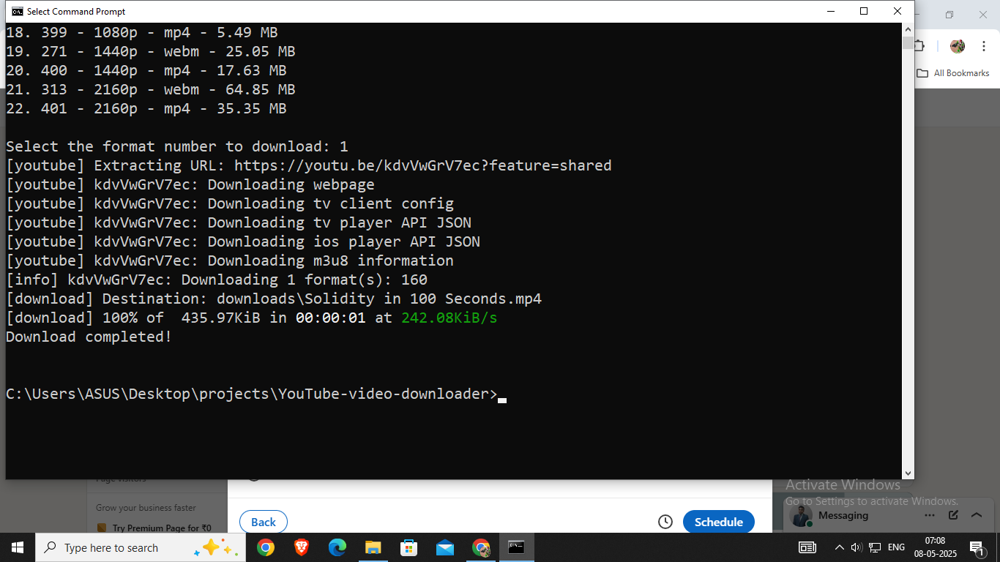

## create folder name `downloads` 
- all the files will be saved in downloads folder


## ✅ Supported platforms (examples):
- YouTube (youtube.com)

- Vimeo

- Dailymotion

- Facebook videos

- Instagram videos

- Twitter/X (limited)

- SoundCloud

- Twitch VODs

- Bilibili

- TikTok

- News sites, adult sites, etc.

## how to run:-

```
py <file_name>.py
```

- `download_file.py`&`download_file1.py` only download video without audio (provides video quality option)
- `high-quality_audio_video.py` download high quality video (don't provide video quality option)


